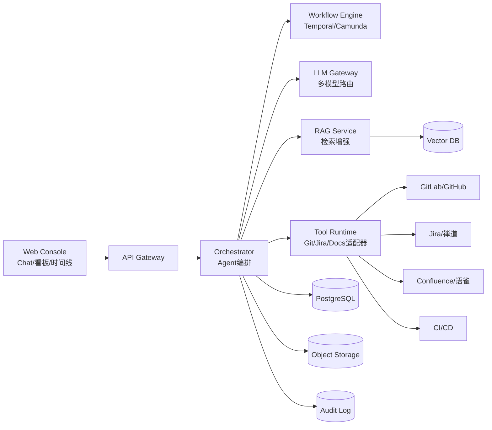
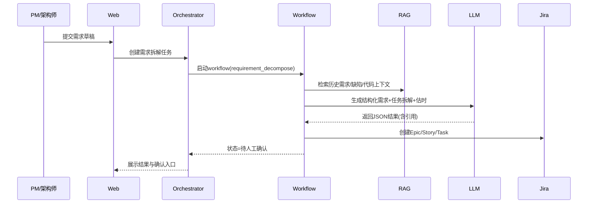

# AI研发协作平台 - 技术架构蓝图 v0.1

- 版本：v0.1
- 日期：2026-03-01
- 适用阶段：MVP（单团队试点）

## 1. 架构目标

1. 建立统一的研发协作数据底座（代码、任务、文档、流程状态）。
2. 通过 Agent + Workflow 实现可控自动化，而非不可审计的自由对话。
3. 支持“可追溯、可审计、可回滚”的 AI 协作行为。

## 2. 总体架构

## 3. 核心模块设计

### 3.1 Web Console
1. Chat协作区：多角色对话、指令模板、证据引用。
2. 项目看板：里程碑、任务状态、阻塞清单、健康度分。
3. 文档中心：自动生成文档草稿、版本比对、审批发布。

### 3.2 API Gateway
1. 统一鉴权入口（JWT/OIDC）。
2. 限流与租户隔离（按Workspace维度）。
3. 请求追踪ID注入，串联全链路日志。

### 3.3 Agent Orchestrator
1. 管理 Agent 角色（PM/Architect/Dev/QA/PMO）。
2. 解析用户意图并选择 Workflow。
3. 聚合工具调用结果，生成带证据的最终输出。

### 3.4 Workflow Engine
1. 固化流程：需求结构化、任务拆解、进度巡检、文档更新。
2. 支持人工节点（审批/确认）与自动节点混编。
3. 失败重试、超时补偿、状态回放。

### 3.5 LLM Gateway
1. 模型路由（复杂推理模型、低成本模型分级调用）。
2. Prompt模板管理（按角色与场景版本化）。
3. 输出约束（JSON Schema）与安全过滤（敏感词/越权指令）。

### 3.6 RAG Service
1. 数据摄取：代码、PRD、任务、历史缺陷、会议纪要。
2. 分块与索引：按语义和结构双策略。
3. 检索策略：Hybrid Search（向量+关键词）+ 重排序。

### 3.7 Tool Runtime
1. 标准化工具协议（输入参数校验、超时、重试、幂等键）。
2. 外部集成适配器：Git/Jira/Confluence/CI。
3. 操作分级：只读、写入、执行命令（分级审批）。

### 3.8 Data Layer
1. PostgreSQL：Workspace、任务映射、流程状态、指标快照。
2. Vector DB：知识片段向量索引。
3. Object Storage：文档版本、流程图、导出文件。
4. Audit Log：Prompt、工具调用、审批轨迹、结果摘要。

## 4. 关键数据模型（简版）

### 4.1 实体
1. Workspace(id, name, owner, status, created_at)
2. Project(id, workspace_id, name, repo_url, tracker_type, doc_space)
3. Requirement(id, project_id, title, content, status, version)
4. WorkItem(id, project_id, external_id, type, assignee, estimate, status)
5. Risk(id, project_id, level, reason, mitigation, owner, due_date)
6. DocAsset(id, project_id, doc_type, uri, version, source_trace)
7. AgentRun(id, workspace_id, agent_type, input_hash, output_ref, result_status)
8. ToolCall(id, agent_run_id, tool_name, params, result, approval_id)
9. Approval(id, scope, requester, approver, status, decided_at)

### 4.2 关系
1. Workspace 1:N Project
2. Project 1:N Requirement/WorkItem/Risk/DocAsset
3. AgentRun 1:N ToolCall
4. ToolCall N:1 Approval（高风险操作）

## 5. 关键流程时序

### 5.1 需求拆解流程

### 5.2 风险巡检流程（每日）
1. 定时拉取任务状态、提交活跃度、缺陷数据。
2. 计算偏差指标（计划偏差、阻塞时长、缺陷回归）。
3. 调用LLM生成风险摘要与行动建议。
4. 写入风险库并推送到看板与群通知。

## 6. 对外接口（示例）

### 6.1 创建Workspace
- `POST /api/v1/workspaces`
- 请求体：`name`, `owner`, `integrations[]`
- 返回：`workspace_id`, `status`

### 6.2 触发需求拆解
- `POST /api/v1/projects/{project_id}/requirements/{id}/decompose`
- 请求体：`mode(auto|review)`, `sync_to_tracker`
- 返回：`workflow_run_id`

### 6.3 获取风险看板
- `GET /api/v1/projects/{project_id}/risks?date=2026-03-01`
- 返回：风险等级分布、阻塞TopN、延期概率。

### 6.4 导出周报
- `POST /api/v1/projects/{project_id}/reports/weekly/export`
- 返回：`doc_uri`, `version`

## 7. 安全与合规

1. 身份认证：统一SSO（OIDC/SAML二选一）。
2. 权限模型：RBAC + Workspace级别数据隔离。
3. 密钥管理：第三方Token集中托管（KMS/Vault）。
4. 数据保护：传输TLS、存储加密、敏感字段脱敏。
5. 审计追踪：所有Agent输出和工具调用可追溯。
6. 操作防护：高风险命令双人审批 + 白名单。

## 8. 可观测性

1. 指标：请求延迟、工具调用成功率、workflow成功率、AI采纳率。
2. 日志：按trace_id聚合API/Workflow/Tool日志。
3. 告警：workflow失败、外部集成异常、检索命中率下降。

## 9. 技术选型建议（MVP）

1. 前端：React + TypeScript + Ant Design（快速构建管理台）。
2. 后端：Node.js(NestJS) 或 Go(Fiber) 二选一（建议按团队熟悉度）。
3. 工作流：Temporal（代码化流程、重试补偿能力强）。
4. 数据库：PostgreSQL + Redis。
5. 向量库：pgvector（MVP一体化）或 Milvus（规模化）。
6. 模型网关：自建Gateway + OpenAI/Claude/本地模型混合。

## 10. 部署拓扑（MVP）

1. 环境：Dev/Test/Prod 三环境隔离。
2. 部署：Kubernetes（应用）+ Managed PostgreSQL + Object Storage。
3. CI/CD：主干合并触发构建，灰度发布到试点Workspace。

## 11. 分阶段实施计划

1. 阶段A（0-2周）：基础设施、鉴权、Workspace与集成配置。
2. 阶段B（3-6周）：需求结构化、任务拆解、Jira同步。
3. 阶段C（7-8周）：风险看板、周报自动化、试点验收。
4. 阶段D（9-12周）：受控命令执行、审批流、质量门禁联动。

## 12. 架构决策记录（ADR）建议首批

1. ADR-001：Workflow引擎选型（Temporal vs 自研状态机）。
2. ADR-002：向量存储方案（pgvector vs 独立向量库）。
3. ADR-003：工具调用权限分级与审批策略。
4. ADR-004：多模型路由策略与成本上限控制。

## 13. MVP退出标准（架构视角）

1. 端到端流程成功率 >= 95%。
2. P0接口可用率 >= 99.9%。
3. 风险预警准确率达到可运营阈值（由试点团队定义，建议>=70%）。
4. 所有高风险操作均有审批和审计记录。
